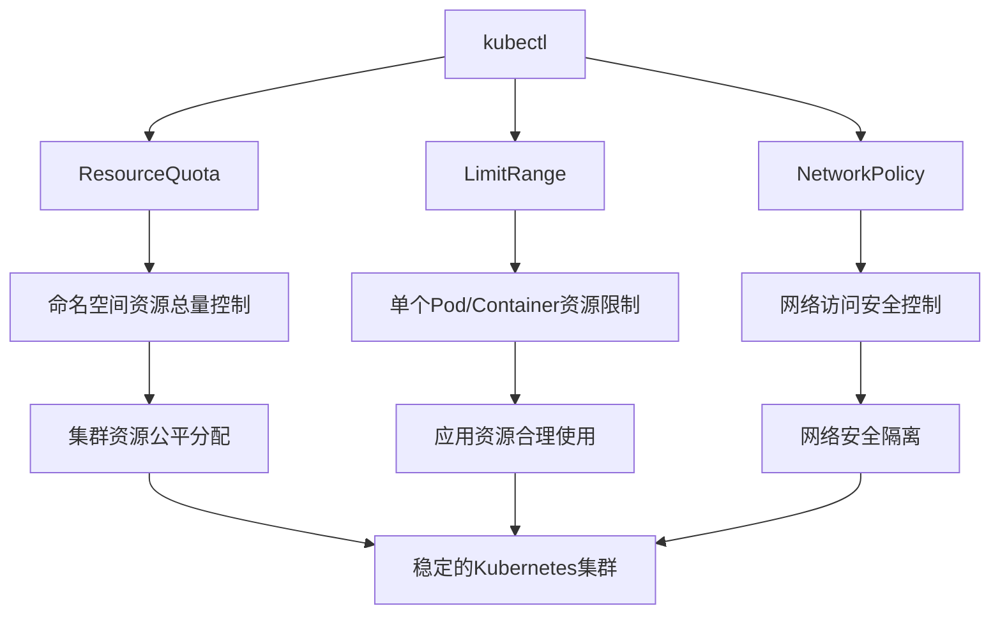

# Kubernetes 资源管理综合指南

## 概述

Kubernetes 提供了完整的资源管理机制，通过 kubectl、NetworkPolicy、LimitRange 和 ResourceQuota 四个核心组件的协同工作，实现集群资源的有效管理和安全控制。


*图：Kubernetes 集群架构示意图*

## 四大组件关系图



## 组件功能对比

| 组件 | 作用范围 | 主要功能 | 使用场景 |
|------|----------|----------|----------|
| kubectl | 集群管理 | 命令行工具，资源操作 | 日常运维、故障排查 |
| ResourceQuota | 命名空间级别 | 限制资源总量 | 多租户、资源隔离 |
| LimitRange | Pod/Container级别 | 设置默认值和约束 | 资源标准化、防止浪费 |
| NetworkPolicy | 网络层面 | 控制Pod间通信 | 微服务安全、网络隔离 |


*图：Kubernetes 资源管理组件协同工作示意图*

## 综合配置示例

### 1. 生产环境完整配置

#### 命名空间配置
```yaml
# 创建生产命名空间
apiVersion: v1
kind: Namespace
metadata:
  name: production
  labels:
    environment: production
    tier: critical
```

#### ResourceQuota 配置
```yaml
apiVersion: v1
kind: ResourceQuota
metadata:
  name: production-quota
  namespace: production
spec:
  hard:
    # 计算资源总量
    requests.cpu: "20"
    requests.memory: "40Gi"
    limits.cpu: "40"
    limits.memory: "80Gi"
    
    # 对象数量限制
    pods: "100"
    services: "20"
    persistentvolumeclaims: "30"
    deployments.apps: "15"
    
    # 存储资源
    requests.storage: "500Gi"
```

#### LimitRange 配置
```yaml
apiVersion: v1
kind: LimitRange
metadata:
  name: production-limits
  namespace: production
spec:
  limits:
  - type: Container
    default:
      cpu: "500m"
      memory: "512Mi"
    defaultRequest:
      cpu: "250m"
      memory: "256Mi"
    max:
      cpu: "2"
      memory: "2Gi"
    min:
      cpu: "100m"
      memory: "128Mi"
  
  - type: Pod
    max:
      cpu: "4"
      memory: "4Gi"
```

#### NetworkPolicy 配置
```yaml
apiVersion: networking.k8s.io/v1
kind: NetworkPolicy
metadata:
  name: production-network-policy
  namespace: production
spec:
  podSelector: {}
  policyTypes:
  - Ingress
  - Egress
  
  ingress:
  - from:
    - namespaceSelector:
        matchLabels:
          name: monitoring
    ports:
    - protocol: TCP
      port: 8080
    - protocol: TCP
      port: 9100
  
  egress:
  - to:
    - ipBlock:
        cidr: 8.8.8.8/32
    ports:
    - protocol: UDP
      port: 53
```

## 实际工作流程

### 1. 应用部署流程

```bash
# 1. 创建命名空间
kubectl create namespace myapp-production

# 2. 应用 ResourceQuota
kubectl apply -f resourcequota.yaml -n myapp-production

# 3. 应用 LimitRange
kubectl apply -f limitrange.yaml -n myapp-production

# 4. 应用 NetworkPolicy
kubectl apply -f networkpolicy.yaml -n myapp-production

# 5. 部署应用
kubectl apply -f deployment.yaml -n myapp-production
```

### 2. 资源监控和调整

```bash
# 查看命名空间资源使用情况
kubectl get resourcequota -n myapp-production

# 查看 Pod 资源使用
kubectl top pods -n myapp-production

# 查看网络策略状态
kubectl get networkpolicies -n myapp-production

# 查看资源限制详情
kubectl describe limitrange -n myapp-production
```

## 多环境配置策略

### 1. 开发环境（宽松配置）

#### ResourceQuota - 开发环境
```yaml
apiVersion: v1
kind: ResourceQuota
metadata:
  name: dev-resource-quota
  namespace: development
spec:
  hard:
    requests.cpu: "4"
    requests.memory: "8Gi"
    pods: "30"
```

#### LimitRange - 开发环境
```yaml
apiVersion: v1
kind: LimitRange
metadata:
  name: dev-limit-range
  namespace: development
spec:
  limits:
  - type: Container
    default:
      cpu: "200m"
      memory: "256Mi"
    max:
      cpu: "1"
      memory: "1Gi"
```

#### NetworkPolicy - 开发环境（允许自由访问）
```yaml
apiVersion: networking.k8s.io/v1
kind: NetworkPolicy
metadata:
  name: dev-network-policy
  namespace: development
spec:
  podSelector: {}
  policyTypes: []
```

### 2. 测试环境（中等限制）

#### ResourceQuota - 测试环境
```yaml
apiVersion: v1
kind: ResourceQuota
metadata:
  name: test-resource-quota
  namespace: testing
spec:
  hard:
    requests.cpu: "8"
    requests.memory: "16Gi"
    pods: "50"
```

#### LimitRange - 测试环境
```yaml
apiVersion: v1
kind: LimitRange
metadata:
  name: test-limit-range
  namespace: testing
spec:
  limits:
  - type: Container
    default:
      cpu: "500m"
      memory: "512Mi"
    max:
      cpu: "2"
      memory: "2Gi"
```

#### NetworkPolicy - 测试环境（基础隔离）
```yaml
apiVersion: networking.k8s.io/v1
kind: NetworkPolicy
metadata:
  name: test-network-policy
  namespace: testing
spec:
  podSelector: {}
  policyTypes:
  - Ingress
  ingress:
  - from:
    - namespaceSelector:
        matchLabels:
          environment: testing
```

### 3. 生产环境（严格限制）

#### ResourceQuota - 生产环境
```yaml
apiVersion: v1
kind: ResourceQuota
metadata:
  name: prod-resource-quota
  namespace: production
spec:
  hard:
    requests.cpu: "20"
    requests.memory: "40Gi"
    pods: "100"
```

#### LimitRange - 生产环境
```yaml
apiVersion: v1
kind: LimitRange
metadata:
  name: prod-limit-range
  namespace: production
spec:
  limits:
  - type: Container
    default:
      cpu: "500m"
      memory: "512Mi"
    max:
      cpu: "2"
      memory: "2Gi"
    min:
      cpu: "100m"
      memory: "128Mi"
```

#### NetworkPolicy - 生产环境（严格隔离）
```yaml
apiVersion: networking.k8s.io/v1
kind: NetworkPolicy
metadata:
  name: prod-network-policy
  namespace: production
spec:
  podSelector: {}
  policyTypes:
  - Ingress
  - Egress
  ingress:
  - from:
    - podSelector:
        matchLabels:
          app: frontend
    ports:
    - protocol: TCP
      port: 80
```

## 故障排查指南

### 1. Pod 创建失败排查

```bash
# 检查 ResourceQuota 限制
kubectl describe resourcequota -n <namespace>

# 检查 LimitRange 约束
kubectl describe limitrange -n <namespace>

# 查看 Pod 事件
kubectl describe pod <pod-name> -n <namespace>

# 检查网络策略
kubectl get networkpolicies -n <namespace>
```

### 2. 网络连接问题排查

```bash
# 测试 Pod 间网络连通性
kubectl run test-pod --image=busybox --rm -it -- /bin/sh
# 在 Pod 内执行: nc -zv <target-pod-ip> <port>

# 查看 NetworkPolicy 详情
kubectl describe networkpolicy <policy-name> -n <namespace>

# 检查服务端点
kubectl get endpoints <service-name> -n <namespace>
```

### 3. 资源使用异常排查

```bash
# 查看资源使用情况
kubectl top pods -n <namespace>

# 查看 ResourceQuota 使用比例
kubectl get resourcequota -o yaml -n <namespace>

# 检查 Pod 资源设置
kubectl get pod <pod-name> -o yaml -n <namespace>
```

## 最佳实践总结

### 1. 资源管理策略
- **分层管理**: 使用命名空间进行逻辑隔离
- **渐进式限制**: 从宽松到严格逐步实施
- **监控预警**: 设置资源使用率告警阈值
- **定期审查**: 定期评估和调整资源配置

### 2. 安全策略
- **最小权限原则**: 只授予必要的网络访问权限
- **标签标准化**: 使用一致的标签命名规范
- **环境隔离**: 不同环境使用不同的安全策略
- **审计日志**: 记录关键操作和访问日志

### 3. 运维效率
- **自动化部署**: 使用 CI/CD 自动化资源配置
- **模板化配置**: 创建可重用的配置模板
- **文档化流程**: 记录操作流程和故障处理步骤
- **团队培训**: 确保团队成员理解资源管理原则

## 工具和扩展

### 1. kubectl 插件推荐
- **kube-ps1**: 在命令行提示符显示当前上下文
- **kubectx**: 快速切换 Kubernetes 上下文
- **kubens**: 快速切换命名空间
- **stern**: 多 Pod 日志追踪工具

### 2. 监控工具集成
- **Prometheus**: 资源使用监控和告警
- **Grafana**: 资源使用可视化仪表板
- **Kubernetes Dashboard**: Web 管理界面

### 3. 策略管理工具
- **OPA/Gatekeeper**: 策略即代码管理
- **Kyverno**: Kubernetes 原生策略引擎

通过合理配置和使用 kubectl、ResourceQuota、LimitRange 和 NetworkPolicy，可以构建安全、稳定、高效的 Kubernetes 集群环境。